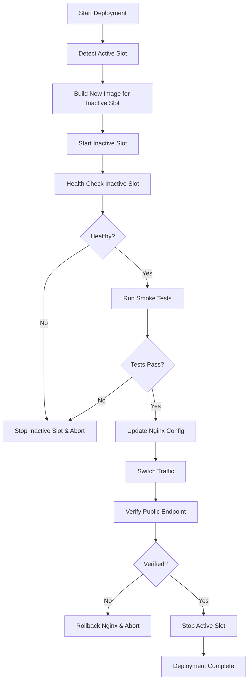

# TSH ERP Ecosystem - Comprehensive Deployment Guide

**Last Updated:** 2025-11-15
**Version:** 2.0.0

---

## Table of Contents

1. [Overview](#overview)
2. [Deployment Architecture](#deployment-architecture)
3. [Environment Configuration](#environment-configuration)
4. [Docker Compose Files](#docker-compose-files)
5. [Blue-Green Deployment](#blue-green-deployment)
6. [GitHub Actions Workflows](#github-actions-workflows)
7. [Manual Deployment](#manual-deployment)
8. [Rollback Procedures](#rollback-procedures)
9. [Health Checks](#health-checks)
10. [Troubleshooting](#troubleshooting)

---

## Overview

TSH ERP uses a modern, production-grade deployment pipeline with:

- **Zero-Downtime Deployments**: Blue-green strategy for production
- **Automated CI/CD**: GitHub Actions for staging and production
- **Container Orchestration**: Docker Compose with multi-stage builds
- **Health Monitoring**: Comprehensive health checks and smoke tests
- **Quick Rollback**: Automated rollback capability (<2 minutes)
- **Image Registry**: GitHub Container Registry (GHCR) for versioned images

### Deployment Environments

| Environment | URL | Branch | Auto-Deploy | Purpose |
|-------------|-----|--------|-------------|---------|
| **Development** | localhost | any | No | Local development |
| **Staging** | staging.erp.tsh.sale | develop | Yes | Pre-production testing |
| **Production** | erp.tsh.sale | main | Yes | Live production system |

---

## Deployment Architecture

### Production Architecture (Blue-Green)

```
┌─────────────────────────────────────────────────────┐
│                 Nginx Reverse Proxy                  │
│              (Port 80/443 - SSL/TLS)                │
└──────────────┬──────────────────────┬────────────────┘
               │                      │
               │ Active Slot          │ Inactive Slot
               ↓                      ↓
       ┌───────────────┐      ┌───────────────┐
       │  Backend API  │      │  Backend API  │
       │  (Blue/Green) │      │  (Blue/Green) │
       │   Port 8001   │      │   Port 8011   │
       └───────┬───────┘      └───────┬───────┘
               │                      │
               └──────────┬───────────┘
                          │
                          ↓
              ┌────────────────────────┐
              │   PostgreSQL Database   │
              │      (Persistent)       │
              └────────────────────────┘
                          │
                          ↓
              ┌────────────────────────┐
              │    Redis Cache          │
              │    (Persistent)         │
              └────────────────────────┘
```

### Multi-Container Setup

```yaml
Services:
  - tsh_postgres: PostgreSQL 15 (persistent data)
  - tsh_redis: Redis 7 (cache/sessions)
  - app_blue: Backend API (Blue slot)
  - app_green: Backend API (Green slot)
  - neurolink: Notification service
  - tds_admin_dashboard: Next.js dashboard
  - nginx: Reverse proxy (optional)
```

---

## Environment Configuration

### Creating Environment Files

#### Staging Environment

```bash
# Copy template
cp .env.staging.template .env.staging

# Edit with production values
nano .env.staging
```

**Required Variables:**
- `POSTGRES_PASSWORD`: Strong database password
- `JWT_SECRET_KEY`: 256-bit random key
- `RESEND_API_KEY`: Email service API key
- `ZOHO_CLIENT_ID`, `ZOHO_CLIENT_SECRET`: Zoho OAuth credentials
- `AWS_ACCESS_KEY_ID`, `AWS_SECRET_ACCESS_KEY`: AWS credentials

#### Production Environment

```bash
# Copy template
cp .env.production.template .env.production

# Edit with production values (use strong credentials!)
nano .env.production
```

**Critical Security:**
- Never commit `.env.staging` or `.env.production` to git
- Use strong, unique passwords for production
- Rotate secrets regularly
- Store backup copies securely

---

## Docker Compose Files

### File Structure

```
TSH_ERP_Ecosystem/
├── docker-compose.yml               # Development (legacy)
├── docker-compose.staging.yml       # Staging environment
├── docker-compose.production.yml    # Production (Blue-Green)
└── Dockerfile                       # Main backend image
```

### Staging Deployment

```bash
# Start staging environment
docker compose -f docker-compose.staging.yml up -d

# View logs
docker compose -f docker-compose.staging.yml logs -f

# Stop staging
docker compose -f docker-compose.staging.yml down
```

### Production Deployment

```bash
# Start production (blue slot by default)
docker compose -f docker-compose.production.yml up -d

# Start green slot for blue-green deployment
docker compose -f docker-compose.production.yml --profile green up -d app_green

# Check running services
docker compose -f docker-compose.production.yml ps
```

---

## Blue-Green Deployment

### Concept

Blue-Green deployment eliminates downtime by:
1. Running two identical production environments (Blue and Green)
2. Deploying new version to inactive environment
3. Testing inactive environment thoroughly
4. Switching traffic from active to new environment
5. Keeping old environment running for quick rollback

### Automatic Blue-Green (via GitHub Actions)

```bash
# On main branch push, GitHub Actions will:
# 1. Determine current active slot (blue or green)
# 2. Deploy to inactive slot
# 3. Run health checks on inactive slot
# 4. Switch Nginx to point to new slot
# 5. Verify public endpoint
# 6. Stop old slot
```

### Manual Blue-Green Deployment

```bash
# Navigate to project directory
cd /opt/tsh-erp

# Run blue-green deployment script
./scripts/deployment/blue_green_deploy.sh v1.2.3

# The script will:
# - Detect active slot
# - Build and start new slot
# - Run health checks
# - Update Nginx configuration
# - Switch traffic
# - Stop old slot
```

### Deployment Flow



---

## GitHub Actions Workflows

### Staging Deployment (`deploy-staging.yml`)

**Trigger:** Push to `develop` branch

**Steps:**
1. Run tests (linting, type checking, unit tests)
2. Build Docker images
3. Deploy to staging server via SSH
4. Run health checks
5. Run smoke tests
6. Send notification (Telegram)

**Manual Trigger:**
```bash
# Via GitHub UI: Actions → Deploy to Staging → Run workflow
```

### Production Deployment (`deploy-production.yml`)

**Trigger:** Push to `main` branch or manual dispatch

**Steps:**
1. Determine version to deploy
2. Run pre-deployment checks
3. Backup production database to AWS S3
4. Blue-green deployment to production
5. Run comprehensive smoke tests
6. Automatic rollback if tests fail
7. Send notifications

**Manual Trigger:**
```bash
# Via GitHub UI: Actions → Deploy to Production → Run workflow
# Select optional parameters:
# - Version to deploy
# - Skip tests (not recommended)
# - Skip backup (not recommended)
```

### Build and Push to GHCR (`build-and-push-ghcr.yml`)

**Trigger:** Push to `main`, `develop`, or tags

**Purpose:** Build and push versioned Docker images to GitHub Container Registry

**Images Built:**
- `ghcr.io/qmop1967/tsh-erp:latest`
- `ghcr.io/qmop1967/tsh-erp-neurolink:latest`
- `ghcr.io/qmop1967/tsh-erp-tds-dashboard:latest`

---

## Manual Deployment

### Prerequisites

- SSH access to production server (167.71.39.50)
- Docker and Docker Compose installed
- Git repository cloned to `/opt/tsh-erp`
- Environment files configured

### Step-by-Step Production Deployment

#### 1. Connect to Server

```bash
ssh root@167.71.39.50
cd /opt/tsh-erp
```

#### 2. Pull Latest Code

```bash
git fetch origin
git checkout main
git pull origin main
```

#### 3. Update Dependencies

```bash
source .venv/bin/activate
pip install -r requirements.txt
```

#### 4. Run Blue-Green Deployment

```bash
./scripts/deployment/blue_green_deploy.sh
```

#### 5. Verify Deployment

```bash
# Check service status
docker compose -f docker-compose.production.yml ps

# Check health endpoint
curl https://erp.tsh.sale/health

# View logs
docker compose -f docker-compose.production.yml logs -f --tail=100
```

---

## Rollback Procedures

### Automatic Rollback

GitHub Actions will automatically rollback if:
- Health checks fail on new deployment
- Smoke tests fail
- Public endpoint verification fails

### Manual Rollback

#### Using Rollback Script (Recommended)

```bash
cd /opt/tsh-erp
./scripts/deployment/rollback.sh

# Or rollback to specific version
./scripts/deployment/rollback.sh v1.2.2
```

#### Manual Rollback Steps

```bash
# 1. Identify inactive slot (will become active after rollback)
docker ps -a | grep tsh_erp_app

# 2. Start inactive slot
docker compose -f docker-compose.production.yml up -d app_blue
# or
docker compose -f docker-compose.production.yml --profile green up -d app_green

# 3. Wait for health
sleep 30
curl http://localhost:8001/health  # or 8011 for green

# 4. Update Nginx
nano /etc/nginx/sites-available/tsh-erp
# Change upstream port

nginx -t && nginx -s reload

# 5. Stop problematic slot
docker compose -f docker-compose.production.yml stop app_green
# or app_blue
```

**Rollback Time:** <2 minutes

---

## Health Checks

### Automated Health Checks

All services include Docker health checks:

```yaml
healthcheck:
  test: ["CMD", "curl", "-f", "http://localhost:8000/health"]
  interval: 30s
  timeout: 10s
  retries: 3
  start_period: 40s
```

### Manual Health Check Script

```bash
# Check specific environment
./scripts/deployment/health_check.sh http://localhost:8001

# Check production
./scripts/deployment/health_check.sh https://erp.tsh.sale
```

### Health Check Endpoints

| Endpoint | Description | Expected Response |
|----------|-------------|-------------------|
| `/health` | Basic health | `{"status": "healthy"}` |
| `/docs` | API documentation | 200 OK |
| `/openapi.json` | OpenAPI spec | 200 OK |

---

## Troubleshooting

### Common Issues

#### 1. Deployment Fails - Database Connection

```bash
# Check PostgreSQL status
docker logs tsh_postgres

# Verify database credentials
docker compose -f docker-compose.production.yml exec app_blue env | grep DATABASE_URL

# Test database connection
docker compose -f docker-compose.production.yml exec app_blue python -c "from app.db import engine; engine.connect()"
```

#### 2. Health Check Fails

```bash
# Check application logs
docker logs tsh_erp_app_blue --tail=100

# Check if service is listening
docker exec tsh_erp_app_blue netstat -tuln | grep 8000

# Manual health check
curl -v http://localhost:8001/health
```

#### 3. Nginx Not Routing Traffic

```bash
# Test Nginx configuration
nginx -t

# Check Nginx error logs
tail -f /var/log/nginx/error.log

# Verify upstream configuration
cat /etc/nginx/sites-available/tsh-erp | grep upstream

# Reload Nginx
nginx -s reload
```

#### 4. Blue-Green Deployment Stuck

```bash
# Check both slots
docker ps | grep tsh_erp_app

# Force stop problematic slot
docker compose -f docker-compose.production.yml stop app_green
docker compose -f docker-compose.production.yml stop app_blue

# Restart known good slot
docker compose -f docker-compose.production.yml up -d app_blue
```

#### 5. Out of Disk Space

```bash
# Check disk usage
df -h

# Clean up Docker
docker system prune -af --volumes

# Clean old images
docker images | grep tsh-erp | grep -v latest | awk '{print $3}' | xargs docker rmi

# Clean logs
find /var/log -name "*.log" -mtime +30 -delete
```

### Monitoring Commands

```bash
# Real-time container stats
docker stats

# Check all container health
docker ps --format "table {{.Names}}\t{{.Status}}"

# View recent logs from all services
docker compose -f docker-compose.production.yml logs --tail=50 --timestamps

# Check resource usage
htop
```

---

## Best Practices

### Before Deployment

- [ ] Test thoroughly in staging environment
- [ ] Review git diff for changes
- [ ] Check database migrations
- [ ] Verify all secrets are updated
- [ ] Notify team of upcoming deployment
- [ ] Check current system load

### During Deployment

- [ ] Monitor deployment logs in real-time
- [ ] Watch health check progress
- [ ] Verify no errors in application logs
- [ ] Test critical user flows immediately
- [ ] Monitor error tracking (Sentry)

### After Deployment

- [ ] Verify all services are healthy
- [ ] Run smoke tests manually if needed
- [ ] Monitor error rates for 30 minutes
- [ ] Check database backup completed
- [ ] Update deployment documentation
- [ ] Notify team of completion

---

## Emergency Contacts

**Production Issues:**
- DevOps Lead: [Contact Info]
- Project Owner: Khaleel Al-Mulla
- Emergency Rollback: `./scripts/deployment/rollback.sh`

**Critical Service Failures:**
1. Run rollback immediately
2. Investigate logs
3. Fix issue in develop branch
4. Deploy fix through staging first
5. Deploy to production after verification

---

## Additional Resources

- [Docker Compose Documentation](https://docs.docker.com/compose/)
- [GitHub Actions Documentation](https://docs.github.com/en/actions)
- [Nginx Blue-Green Deployment](https://www.nginx.com/blog/blue-green-deployments-with-nginx/)
- [PostgreSQL Backup Best Practices](https://www.postgresql.org/docs/current/backup.html)

---

**Last Updated:** 2025-11-15
**Maintained By:** DevOps Team
**Version:** 2.0.0
